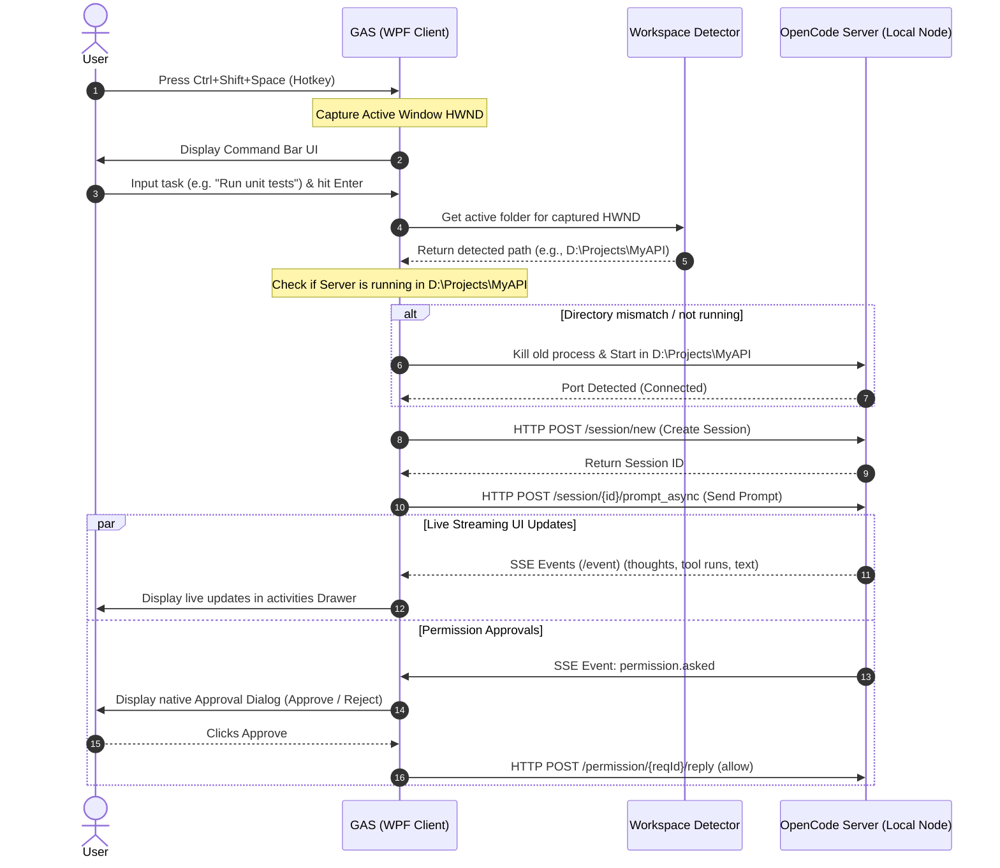

# GAS (Global Agent Service)

GAS is a lightweight, keyboard-first native Windows desktop companion for [OpenCode](https://github.com/anomalyco/opencode). It runs AI coding agents entirely in the background, monitoring their execution from the System Tray and only prompting you with native interactive alerts when authorization (file edits, terminal commands, or browser actions) is required. 

This lets you delegate complex development tasks, walk away from your editor, and stay productive elsewhere without having to babysit the agent.

---

## Table of Contents
1. [Why GAS?](#why-gas)
2. [How It Works](#how-it-works)
3. [Architecture Overview](#architecture-overview)
4. [Core Features](#core-features)
5. [Prerequisites](#prerequisites)
6. [Getting Started](#getting-started)
7. [Configuration & Customization](#configuration--customization)
8. [License & Acknowledgments](#license--acknowledgments)

---

## Why GAS?

Autonomous AI coding agents are highly capable, but they frequently require user feedback or safety confirmations (e.g., executing a command or writing to a file). Traditional CLI-based or IDE-integrated agents force you to keep their terminal or browser windows open. If you look away, the agent sits idle waiting for approval, wasting time.

**GAS changes this paradigm:**
* **System Tray Resident:** The agent runs quietly in the Windows notification area. The tray icon dynamically changes colors to show state (Idle, Thinking, Executing, Waiting, Error).
* **Native OS Interrupts:** When the agent needs permission or asks a question, GAS displays a native notification and popup. You approve or reject, and the agent continues.
* **Workspace-Aware:** Press `Ctrl + Shift + Space` anywhere. GAS auto-detects the project you are working on (whether active in VS Code, Visual Studio, or a focused File Explorer directory) and runs the agent there.

---

## How It Works

Here is the end-to-end flow when you invoke a task:



---

## Architecture Overview

The GAS workspace is split into two main logical projects to ensure clean separation of concern and facilitate potential CLI integrations:

### 1. `GAS.Core` (Class Library)
* **`WorkspaceDetector`**: Uses P/Invoke and Windows Win32 APIs (`GetForegroundWindow`, `GetWindowThreadProcessId`) alongside COM interface queries (`Shell.Application`) to dynamically trace the folder active in the focused VS Code editor, Visual Studio IDE, or File Explorer window.
* **`OpenCodeServer`**: Orchestrates the local Node.js process hosting the OpenCode server (`opencode serve`). Binds the process under a Windows native **Job Object** to guarantee that the server and all orphaned child tools (e.g. headless browsers, compiler runs) terminate cleanly when GAS exits.
* **`OpenCodeClient`**: A lightweight REST and Server-Sent Events (SSE) client wrapper that handles the communications protocol with the server.
* **`GASDbContext`**: Local SQLite database backed by Entity Framework Core to record execution logs and conversational histories.
* **`CredentialStore`**: Manages DPAPI-secured encryption of keys (Anthropic, OpenAI, Gemini) inside the local app data folder.

### 2. `GAS.App` (WPF Desktop Application)
* **`CommandBarWindow`**: A spotlight-like overlay window invoked via global hotkey (`Ctrl + Shift + Space`) allowing fast, mouse-free task submission.
* **`DrawerWindow`**: An activities drawer docked to the right edge of the screen displaying real-time reasoning thoughts, executed tools (Git, compiler, filesystem, browser), and conversational bubbles. **Every text entry and terminal logs inside the drawer is fully selectable and copyable.**
* **`ApprovalWindow`**: An OS-level interrupt dialog showing command arguments, files changed, or browser interactions, prompting the user for approval.

---

## Core Features

### 💻 Code & Development
Exposes the complete development lifecycle capabilities of OpenCode:
* Automatic refactoring, codebase search, and workspace-wide edits.
* Inline compiler fix-ups and unit-testing runners.

### 📁 File System Operations
* Safe file system creation, moving, renaming, and bulk operations.
* Real-time file system diff highlights and selective write logs.

### 🖥️ Terminal & Shell
* Direct invocation of command-line tools and scripts (PowerShell, CMD, Git Bash, WSL).
* Interactive progress of terminal logs directly displayed inside task execution cards.

### 🌐 Browser Automation
* Exposes headless or headful web workflows (Puppeteer/Playwright integrations).
* Supports form completions, web data scraping, and research loops.

### 💬 Smart Approvals & Trust Modes
Supports customizable execution guardrails:
* **Careful**: Prompts the user for every single tool invocation.
* **Balanced**: Automatically permits read-only tasks (e.g. searches, reads) but prompts for destructive mutations (e.g. terminal execution, file edits).
* **YOLO**: Fully autonomous execution—only alerts on completion or critical engine failure.

---

## Prerequisites

To build and run GAS, you must have the following dependencies configured on your Windows machine:
1. **Windows 10 / 11** (uses Windows Win32 APIs and DPAPI).
2. **.NET 8.0 SDK** (to build the solution).
3. **Node.js** (required to host the underlying OpenCode server).

---

## Getting Started

### 1. Install OpenCode Engine
Install the engine globally via `npm`:
```bash
npm install -g opencode-ai
```

### 2. Clone and Build GAS
Clone this repository and compile using the dotnet CLI:
```bash
git clone https://github.com/geezerrrr/GAS.git
cd GAS
dotnet build GAS.sln
```

### 3. Run the Application
You can execute the built binary from the CLI or run it through the project directly:
```bash
dotnet run --project GAS.App/GAS.App.csproj
```
*(On startup, GAS will register in your Windows System Tray. If it does not detect your API credentials, it will prompt you with a native onboarding setup window).*

---

## Configuration & Customization

All configurations are stored locally in the App Data folder:
`%USERPROFILE%\.gemini\antigravity-ide`

You can customize:
* **Global Hotkey bindings** (e.g. `Ctrl + Shift + Space` or `Alt + Ctrl + G`).
* **AI Provider profiles** (OpenAI, Anthropic, Gemini, Ollama, OpenRouter, and Zen).
* **Custom Engine Executable Paths** (if you prefer not to use the globally resolved `npm` installation).

---

## License & Acknowledgments

* Distributed under the **MIT License**. See `LICENSE` for details.
* Powered by [OpenCode](https://github.com/anomalyco/opencode) — the open-source agent engine.
